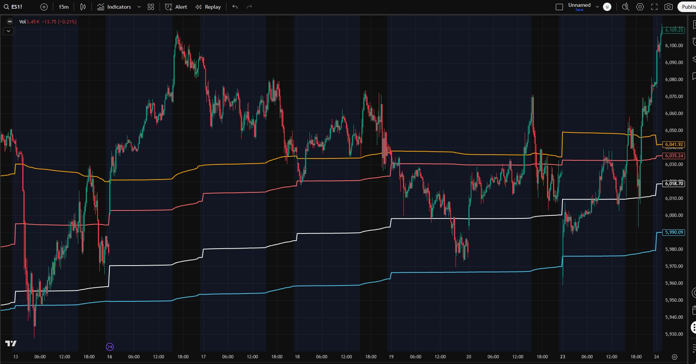

## 4-Period-Rolling-VWAP-Suite
A custom TradingView Pine Script indicator that calculates and plots multiple rolling VWAP (Volume Weighted Average Price) levels over different daily lookback periods. Designed to help traders identify key support/resistance zones and market bias— **especially effective during high or extreme volatility**.

---

## 📸 Screenshot

---

## ✨ Features

- **Multiple Configurable VWAP Periods**:
  - 5-day VWAP
  - 10-day VWAP
  - 15-day VWAP
  - 20-day VWAP
  - Optional 50-day VWAP
- **Dynamic Rolling Calculation**:
  - VWAP levels roll forward with each new day
  - No need to reset at the start of a session
- **Custom Colors** for quick on-chart identification
- Works on **any time frame** and with any instrument on TradingView
- Can be easily added directly from the public TradingView link (see below)

---

## 📎 Direct TradingView Access

You can add this indicator to your TradingView chart directly from the public library:  
**[4-period Rolling VWAP Suite](https://www.tradingview.com/script/89sBe0V5-4-period-Rolling-VWAP-Suite/)**

My TradingView profile: **[EmotionalTrader777](https://www.tradingview.com/u/EmotionalTrader777/)**

---

## 🛠 How It Works

VWAP is calculated as:
VWAP = (Σ (Typical Price × Volume)) / (Σ Volume)

Where:
- **Typical Price** = (High + Low + Close) ÷ 3
- Calculations are **rolled** over the specified number of days rather than resetting daily

This script keeps track of:
- Price × Volume sums
- Volume sums  
Over the last `n` days (5, 10, 15, 20, 50), and dynamically computes VWAP for each period.

---

## ⚡ Use Cases

- **Support & Resistance Mapping**:  
  Rolling VWAP levels often act as magnets for price, providing natural support/resistance.
- **Volatility Periods**:  
  During high volatility, rolling VWAP levels can help anchor trading decisions.
- **Bias Detection**:  
  Price above multiple VWAP levels can suggest bullish bias; below them can suggest bearish bias.

---

## 📋 Inputs

| Setting          | Description                                | Default |
|------------------|--------------------------------------------|---------|
| Show 5D VWAP     | Toggle 5-day rolling VWAP                   | ✅      |
| Show 10D VWAP    | Toggle 10-day rolling VWAP                  | ✅      |
| Show 15D VWAP    | Toggle 15-day rolling VWAP                  | ✅      |
| Show 20D VWAP    | Toggle 20-day rolling VWAP                  | ✅      |
| Show 50D VWAP    | Toggle 50-day rolling VWAP                  | ❌      |

---

## 🎨 Color Scheme

- **5D** – Orange
- **10D** – Soft Red
- **15D** – White
- **20D** – Electric Blue
- **50D** – Golden Yellow

---

## 📦 Installation from Code

1. Copy the code from [`4-Period-Rolling-VWAP-Suite.pine`](4%20period%20Rolling%20VWAP%20Suite.pine.txt)
2. Open **TradingView**
3. Go to **Pine Editor**
4. Paste the code and click **Add to Chart**
5. Save the script to your account

---

## 📜 License

MIT License — You’re free to use, modify, and share this script.

---

## 👤 Author

**EmotionalTrader**  
- Futures trader, Python learner, aspiring asset trader, horse whisperer, space cowboy  
- [TradingView Profile](https://www.tradingview.com/u/EmotionalTrader777/)  
- [GitHub](https://github.com/EmotionalTrader)

